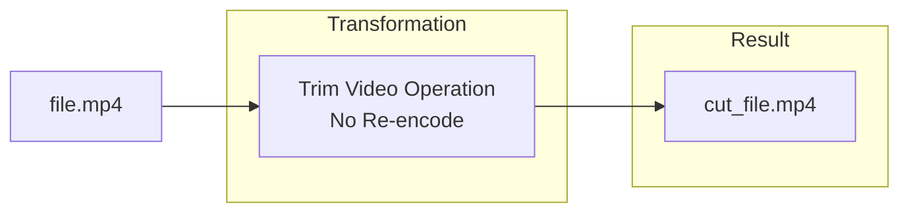
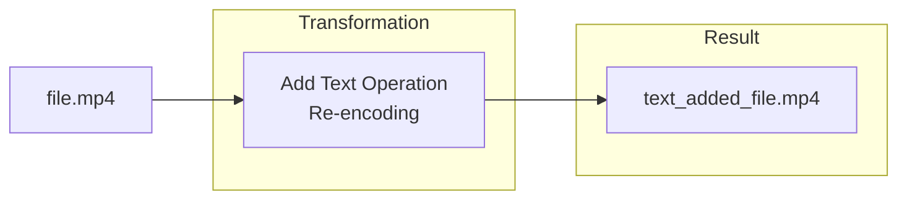

In the summer of 2023, I did a small [contribution](https://github.com/wailsapp/wails/pull/2812) to a very interesting project by the name of [Wails](https://wails.io/).
This open source project boasting over [21,000](https://github.com/wailsapp/wails) stars, had me captivated with a simple fact, you could combine Go and any frontend technology to create
a cross platform desktop application. It's unified [eventing system](https://wails.io/docs/reference/runtime/events) sounded great for this crazy idea I had, call it a bit of a challenge.
**Could I create a simple video editor?**.

There are many full blown video editors that are open source out there such as [Kdenlive](https://kdenlive.org/) and [OpenShot](https://www.openshot.org/), but what I wanted to aim for
was more in the vein of the fantastic [Losslesscut](https://mifi.no/losslesscut/) project by Mikael Finstad, aka [mifi](https://github.com/mifi). What is the main difference of a full blown video editor vs a lossless cut editor?
the key is in re-encoding.

Links/Resources:

- [Gahara](https://github.com/Gahara-Editor/gahara)
- [Wails](https://wails.io/)
