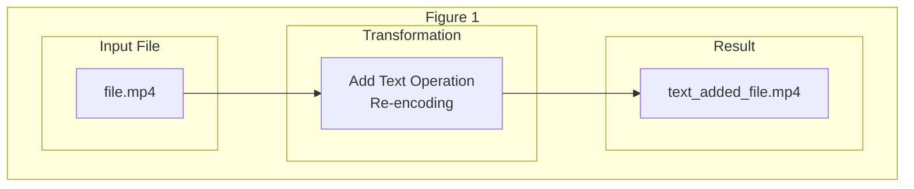
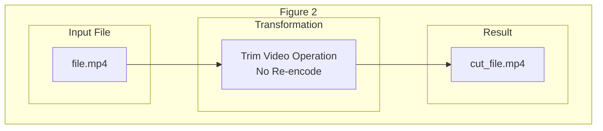

In the summer of 2023, I did a small [contribution](https://github.com/wailsapp/wails/pull/2812) to a very interesting project by the name of [Wails](https://wails.io/).
This open source project boasting over [21,000](https://github.com/wailsapp/wails) stars, had me captivated with a simple fact, you could combine Go and any frontend technology to create
a cross platform desktop application. It's unified [eventing system](https://wails.io/docs/reference/runtime/events) sounded great for this crazy idea I had, call it a bit of a challenge.
**Could I create a simple video editor?**.

There are many full blown video editors that are open source out there such as [Kdenlive](https://kdenlive.org/) and [OpenShot](https://www.openshot.org/), but what I wanted to aim for
was more in the vein of the fantastic [Losslesscut](https://mifi.no/losslesscut/) project by Mikael Finstad, aka [mifi](https://github.com/mifi). What is the main difference of a full blown video editor vs a lossless cut editor?
the key is in **re-encoding**.



<figcaption>Figure 1: Add Text to Video (Lossy operation)</figcaption>

In figure 1, we want to execute an operation on our video frames, in this case we add some text which results in modify frames that makes it so we need to re-encode
our video.



<figcaption>Figure 2: Trim Video (Lossless operation)</figcaption>

In contrast, in figure 2 we want to trim the video, possibly to a shorter clip or multiple shorter clips, this operation can be done without re-encoding the video
since we are simply taking the same frames and partition them.

From this very simple example, we can we would need compute power for lossy operation to re-encode the video, whereas with lossless operations very little compute
is needed to achieve our goal. Initially, I started with the idea of just partitioning a large video into smaller clips (lossless) but I also wanted to join multiple
clips into one video (lossy) as in the style of those very old anime MV's/essays, so with these requirements in mind I set out to create my small video editor.

# Where to Start?

As alluded to early, the framework I decided to use was **Wails** since I became very familiar with its offerings and more importantly it used Go which I had just used
for my [100 days of open source challenge]() early in the year. With the framework selected, now it was time to select tools for the project specifically for video
transformations.

# Meet FFmpeg

Have you heard of Youtube, or perhaps Twitch? great! but do you know about FFmpeg? probably not. [FFmpeg ](https://ffmpeg.org/) is an incredibly powerful set of libraries
and CLI written in C for all video/audio related operations, from recording, and streaming to applying a wide range of video transformations, and a large number of **Codecs**[^1], you name it
if you ever used Youtube or Twitch you have been enjoying the benefits of this piece of software. It was indeed a natural choice for this project.

A basic operation in ffmpeg might look like this

```bash
ffmpeg -i myfile.mov myfile.mp4
```

In the above, we provide themyfile.mov as the input to the ffmpeg cli, we then specify that we would like to output this to myfile.mp4. The key here is that ffmpeg,
although quite complex with a bunch of commands are available, is about getting some inputs and producing outputs, we will expand on the use of the ffmpeg CLI operations later on
as we start to code some of this operation directly in the Go backend.

However, if you ran this command and depending on the length of your video you probably noticed it took a bit to process. Can we intuitively tell why this happen? yes
once again it is **re-encoding** eventhough we did not run any operations that modify our video, we just changed our [video container](https://castr.com/blog/video-containers/).
So, how can we tell ffmpeg that we would like to just like to copy instead of re-encoding? the following achieves that

```bash
ffmpeg -i myfile.mov -c copy myfile.mp4
```

The `-c` flag used here specifies the codec we want to use, and in this case we specify copy which tells ffmpeg to copy both audio (`c:a`) and video (`c:v`) streams.
This command is the key for the trim operation. Some extra modifications will be made to this command but this will serve as the basis to achieve fast clip trimming.

# The Eventing System

# Setting the Wails Project

Links/Resources:

- [Gahara](https://github.com/Gahara-Editor/gahara)
- [Wails](https://wails.io/)

[^1]: https://www.mux.com/video-glossary/codec
