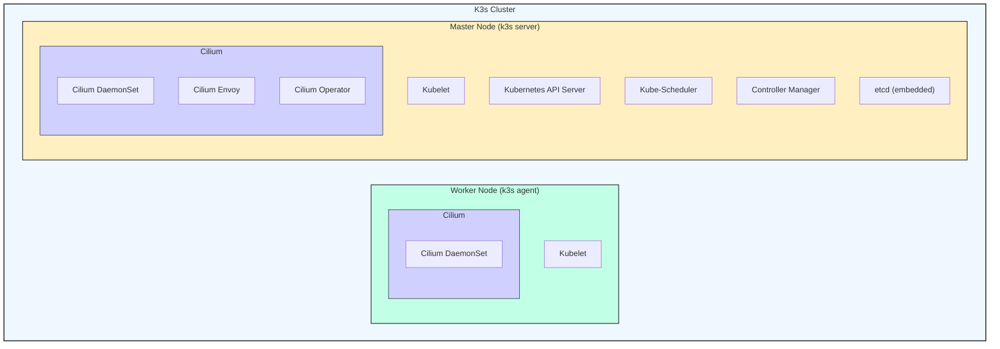

Welcome to another entry in the **Kinho's Homelab Series**, we are following along from the previous [entry]() and today we continue by installing greek engineering helmsman ⎈, the almighty
[**Kubernetes**](https://kubernetes.io/). This will serve as our main orchestration platform to run all the applications we want in our lab through the series.

We will also make some modifications to improve the base installation of k3s by adding the powerful [Cilium](https://cilium.io/) as our **CNI plugin and kube-proxy** replacement, along
the way I'll discuss a few lessons learned.

---

# Deciding on a Kubernetes Distro


Rolling your own Kubernetes on-prem usually can be done in a multiple ways. You could go for [Kubernetes the hard way](https://github.com/kelseyhightower/kubernetes-the-hard-way) if you really want to understand
the guts of Kubernetes installing each component to create the control plane such as **container runtime**, **etcd** distributed key-value database, **api server**, **controller manager**, **scheduler**, **kubelet** and so on.
A more practical way of installing Kubernetes is with [kubeadm](https://kubernetes.io/docs/setup/production-environment/tools/kubeadm/) which makes it much easier, you
can follow along this [iximiuz labs tutorial](https://labs.iximiuz.com/tutorials/provision-k8s-kubeadm-900d1e53) if you are interested in setting it up.

All that said, in the previous entry, we went over [grandma's laptop]() specs which are indeed very tight (until I get to bring a more powerful node as the control plane). Considering that, I needed to install a lighter Kubernetes distribution. Enter [k3s](https://docs.k3s.io/)
a fully compliant Kubernetes distribution by the [Rancher team](https://www.rancher.com/) that is great for edge, embedded, and of course our use case **homelab**.

---

# Installing k3s

We would do a few things to setup our next step. We want to prepare **Cilium** to unify our networking layer, and we will talk about about it in the next sections. For the moment,
that roughly translates to going with the bare minimum k3s installation by disabling the flannel CNI, traefik, servicelb, and kube-proxy.

## Configuring k3s bare minimum

We can set up the options discussed in a unified configuration file which we can then pass to the k3s installation script.
The configuration is as follows:

```k3sconfig.yaml
node-ip: <your-tailscale-ip>
flannel-backend: "none"
disable-kube-proxy: true
disable-network-policy: true
disable:
  - traefik
  - servicelb
tls-san:
  - <your-tailscale-ip>
cluster-init: true
```

Note how I specify the `node-ip` and `tls-san` fields to use tailscale ip for the api server and generate a certificate. Another option that we set is the `cluster-init` option such that the cluster initializes with embedded `etcd` rather than the default sqlite. You can check
all the possible configuration options for the server [here](https://docs.k3s.io/cli/server)

> [!NOTE]
> If you are planning to run a single node setup with no SSD, I recommend sticking with the sqlite setup, but in the long run if you plan on **adding more nodes** to your cluster, installing `etcd` can provide you with with a fully [HA setup](https://docs.k3s.io/datastore/ha-embedded), just make sure to have
> a odd number of server nodes to maintain quorum.

> [!WARNING]
> The kubeconfig file at `/etc/rancher/k3s/k3s.yaml` is owned by root, and written with a default mode of 600. This is actually good, because if you change to 644
> you will allow it to be read by other unprivileged users in the host

Let's install k3s with our configuration file by running the following command.

```bash
curl -sfL https://get.k3s.io | INSTALL_K3S_EXEC="server" sh -s - --config=$HOME/k3sconfig.yaml
```

Now, if we check our cluster we should see the following:

```bash
sudo kubectl get no
```


Importantly, if we list our pods running in kube-system, we can see that a few of our core components: **coredns**, **local-path-provisioner**, and **metrics-server**
are in **pending** state all of which rely on networking. If you went with the default installation of k3s everything should work, however, we will prepare **Cilium**
to take over these components.

---

# The CNCF Landscape is a Powerful Toolbox

The [CNCF Landscape](https://landscape.cncf.io/?view-mode=grid) can be intimidating with the large amount of projects available that contribute to modern cloud computing in different categories
such as orchestration with the golden child **Kubernetes**, to coordination and discovery with **coredns** and **linkerd**. It can be really easy to spent a whole day
scrolling through the different projects, and learning about their use cases.

However, as part of the very first [zero to merge](https://project.linuxfoundation.org/cncf-zero-to-merge-application) cohort of the Linux foundation, I learned that just as you should not contribute to a OSS just for the sake of contributing (actually find a project that you use frequently), you should not **shoehorn** a project just for sake of using it. In the past, I knew
about **Cilium** but what it did went over my head, partly, do to being new with Kubernetes, and the other part due to not seeing how its functionalities fit in the landscape. So, let's
get practical about why we want to configure **Cilium** in our k3s cluster.

---

# Unifying the Cluster's Network Stack with Cilium


From the [official website](https://cilium.io/), we get the following definition:

> Cilium is an open source, cloud native solution for providing, securing, and observing network connectivity between workloads, fueled by the revolutionary Kernel technology eBPF

In the previous section, we purposely went ahead and disable most of the k3s built-ins related to networking in **Flannel CNI**, **Traefik LB**, **ServiceLB**, and **kube-proxy**.
All of those components map to a specific [layer](https://www.cloudflare.com/learning/ddos/glossary/open-systems-interconnection-model-osi/) in our networking stack.
Enter **Cilium**, we will use it to unify our networking stack, that is, as our **CNI plugin** for pod networking, L4 service routing, and L7 load balancer for setting up Gateway API/ingress.

## How can Cilium Achieve all of that ?


Cilium is based on [eBPF](https://ebpf.io/) which can **dynamically program the kernel**. This enables a more performant routing that is not based on
traditional iptables as it is the case with **kube-proxy**. Its **eBPF hashmaps** enables constant performance as opposed to linear scans of iptables, that means that as the services grow performance stays consistent.
Not only that, but since Cilium can integrate neatly with the Linux Kernel, it can provide us with network observability and security policies for our cluster.

Whereas other CNIs provide basic connectivity, Cilium provides powerful features such as:

- Faster native pod-to-pod networking with eBPF (no kube-proxy and iptables overhead)
- Real-time observability with [Hubble]()
- Built-in security with Wireguard encryption
- Advance Network Policy enforcement at multiple layers
- Metal LB replacement with LB IPAM and L2 announcements

Needless to say, Cilium is much more than just a **CNI**, its an important set piece that provides a fast, secure, and observable network stack adaptable to many needs.

---

# Installing Cilium

## Downloading the CLI

Cilium can be installed in a couple of ways via helm charts or with its CLI. We will go ahead and [install its CLI](https://docs.cilium.io/en/latest/gettingstarted/k8s-install-default/#install-the-cilium-cli) for Linux with the following command:

```bash
CILIUM_CLI_VERSION=$(curl -s https://raw.githubusercontent.com/cilium/cilium-cli/main/stable.txt)
CLI_ARCH=amd64
if [ "$(uname -m)" = "aarch64" ]; then CLI_ARCH=arm64; fi
curl -L --fail --remote-name-all https://github.com/cilium/cilium-cli/releases/download/${CILIUM_CLI_VERSION}/cilium-linux-${CLI_ARCH}.tar.gz{,.sha256sum}
sha256sum --check cilium-linux-${CLI_ARCH}.tar.gz.sha256sum
sudo tar xzvfC cilium-linux-${CLI_ARCH}.tar.gz /usr/local/bin
rm cilium-linux-${CLI_ARCH}.tar.gz{,.sha256sum}
```

## Configuring Cilium Installation

Now that we have the CLI, we can go ahead and install Cilium. Before that we need the CLI to have access to the cluster, so we will set the `KUBECONFIG` environment
variable to point to our `k3s.yaml` file in `/etc/rancher/k3s/k3s.yaml`. If you want you can move the file to its usual place under `.kube/config` with the following:

```bash
mkdir -p $HOME/.kube
sudo cp -i /etc/rancher/k3s/k3s.yaml $HOME/.kube/config
echo "export KUBECONFIG=$HOME/.kube/config" >> $HOME/.bashrc
source $HOME/.bashrc
```

We will now specify an `IP` and a `PORT` to run our installation. For the port, we can go ahead and use the [default api server port](https://kubernetes.io/docs/reference/networking/ports-and-protocols/#control-plane), and for the IP
you can go ahead and select what you have added in the previous steps. We can install Cilium with the following command:

```bash
IP=<YOUR-NODE-IP>
PORT=<YOUR-PORT>
cilium install --set k8sServiceHost=${IP} \
--set k8sServicePort=${PORT} \
--set kubeProxyReplacement=true \
--set ipam.operator.clusterPoolIPv4PodCIDRList="10.42.0.0/16"
```

> [!NOTE]
> If we install Cilium by default, you will notice that Cilium sets `cluster-pool-ipv4-cidr: 10.0.0.0/8` as its default in the configuration. We will
> change this to be inline with the default **PodCIDR** of k3s which is `10.42.0.0/16`, if we do not do that then pods will get IPs outside of the
> **PodCIDR** which will break cross-node pod communication with services failing. This can be achieved with the `ipam.operator.clusterPoolIPv4PodCIDRList="<your-podcidr>"`. Learn more about [CIDR]().

Let's check our installation with the following command:

```bash
cilium status --wait
```


Finally, if we check our previous core components under `kube-system` that were in pending state:


---

# Adding Worker Nodes

Let's finish by adding a worker node to our cluster for this I will introduce the second node in the cluster a desktop with i3, 4GB RAM, and GB SSD.

First, we need to get the token located at `/var/lib/rancher/k3s/server/token` with the following command:

```bash
sudo cat /var/lib/rancher/k3s/server/token
```

Similar to how we setup our master, we specify the following configuration for our agent node:

```k3sagent.yaml
node-ip: <your-worker-tailscale-ip>
token: <your-k3s-token>
server: <https://<your-ip>:<your-port>
```

Lastly, we install k3s on the agent as follows:

```bash
curl -sfL https://get.k3s.io | INSTALL_K3S_EXEC="agent" sh -s - --config=$HOME/k3sagent.yaml
```

Checking our nodes with kubectl:

```bash
kubectl get no -owide
```


The resulting cluster will now look like this:



---

# Wrapping up

That's it for this entry, we have made tremendous progress at **Kinho’s Homelab**! We went ahead and installed **k3s** and unified our network stack with **Cilium**.

We now have our own **orchestration platform**, but its looking a little empty. In our next entry, we will start to setup some applications to run in the cluster and some of **Cilium** features
to get services.

---

# Next in Kinho's Homelab Series

**TBD**

# Resources

- [K3s](https://docs.k3s.io/)
- [Cilium](https://cilium.io/)
